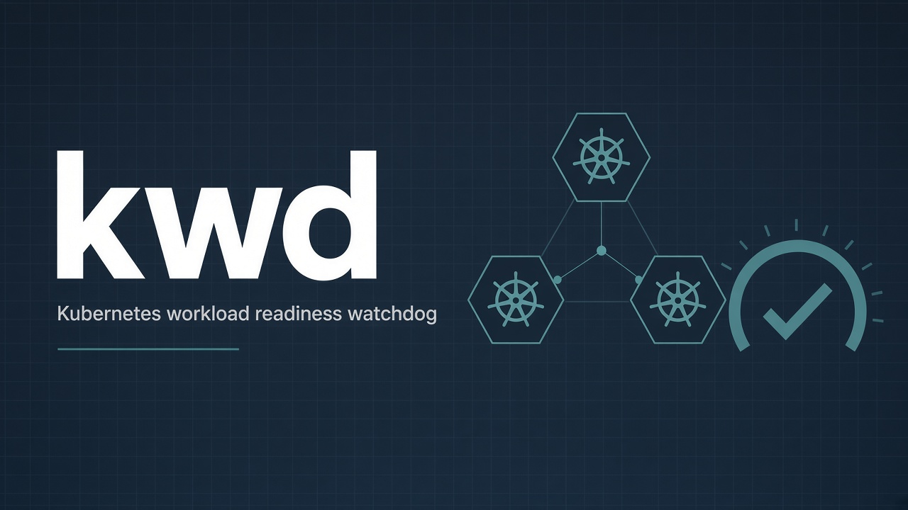

# kwd — Kubernetes Workload Watch Dog

<a id="top"></a>

[](https://github.com/hrodrig/kwd/releases)
[](https://github.com/hrodrig/kwd/releases)
[](./LICENSE)
[](https://go.dev/dl/)
[](https://github.com/hrodrig/kwd/actions/workflows/ci.yml)
[](https://github.com/hrodrig/kwd/actions/workflows/security.yml)
[](https://github.com/hrodrig/kwd/actions/workflows/codeql.yml)
[](https://gghstats.hermesrodriguez.com/hrodrig/kwd)
[](https://pkg.go.dev/github.com/hrodrig/kwd)
[](https://deps.dev/go/github.com%2Fhrodrig%2Fkwd)

**Repo:** [github.com/hrodrig/kwd](https://github.com/hrodrig/kwd) · **Releases:** [GitHub Releases](https://github.com/hrodrig/kwd/releases) · **Spec:** [SPECIFICATIONS.md](SPECIFICATIONS.md) · **Changelog:** [CHANGELOG.md](CHANGELOG.md) · **Contributing:** [CONTRIBUTING.md](CONTRIBUTING.md)

**The problem:** A rollout finishes, and *someone* has to go look — is the Deployment actually ready? Did the StatefulSet come up, or is a pod crash-looping? Most "health checks" are either ad-hoc `kubectl get` squinting at columns, or a full Prometheus/Grafana stack you don't want to stand up just to answer *"is it up?"*.

**How kwd solves it:** a tiny, single-binary CLI (**client-go**, **no `kubectl` binary required**) checks the **readiness** of the workloads you declare. With `interval: 0` it is a **single pass** (exit `0`/`1` for cron/CI). With `interval > 0` it is a **daemon** loop: same check path, notify on transitions (with optional hysteresis), optional HTTP `/healthz` + Prometheus `/metrics`. Point it at a context, list your refs, and let cron, a supervisor, or a probe scrape decide what happens next.

Declarative, out-of-band, and easy to script — the "is this cluster healthy *right now*" answer without a monitoring stack.



**Operator deployment** (cron, systemd, in-cluster): planned in **[kwd-selfhosted](https://github.com/hrodrig/kwd-selfhosted)** — this repo ships the CLI binary, packages, and `ghcr.io/hrodrig/kwd` only (same split as [kzero](https://github.com/hrodrig/kzero) / [pgwd](https://github.com/hrodrig/pgwd)).

**Related tools (same maintainer):**
- **[kwd](https://github.com/hrodrig/kwd)** — Kubernetes workload readiness watchdog ([live traffic](https://gghstats.hermesrodriguez.com/hrodrig/kwd); deploy: [kwd-selfhosted](https://github.com/hrodrig/kwd-selfhosted) when published)
- **[kzero](https://github.com/hrodrig/kzero)** — bastion-first declarative workload reset ([live traffic](https://gghstats.hermesrodriguez.com/hrodrig/kzero); deploy: [kzero-selfhosted](https://github.com/hrodrig/kzero-selfhosted))
- **[groot](https://github.com/hrodrig/groot)** — Kubernetes diagnostics archive ([live traffic](https://gghstats.hermesrodriguez.com/hrodrig/groot); deploy: [groot-selfhosted](https://github.com/hrodrig/groot-selfhosted))
- **[pgwd](https://github.com/hrodrig/pgwd)** — PostgreSQL connection watchdog ([live traffic](https://gghstats.hermesrodriguez.com/hrodrig/pgwd); deploy: [pgwd-selfhosted](https://github.com/hrodrig/pgwd-selfhosted))
- **[gghstats](https://github.com/hrodrig/gghstats)** — GitHub repo traffic beyond 14 days ([live demo](https://gghstats.hermesrodriguez.com); deploy: [gghstats-selfhosted](https://github.com/hrodrig/gghstats-selfhosted))

**Releases** ship **binaries**, **`.deb`** / **`.rpm`**, and **`ghcr.io/hrodrig/kwd`** (Cosign + SBOM via GoReleaser). Behavior contract: **[SPECIFICATIONS.md](SPECIFICATIONS.md)**.

<a id="terminal-demo"></a>
**Terminal demo** (recorded with [VHS](https://github.com/charmbracelet/vhs); source [`docs/demo.tape`](docs/demo.tape)):


Regenerate from the repo root: **[docs/README.md — Terminal demo](docs/README.md#terminal-demo-vhs)**.

## Table of contents

- [Terminal demo](#terminal-demo)
- [How it works](#how-it-works)
- [Quick start](#quick-start)
- [Configuration](#configuration)
- [Readiness semantics](#readiness-semantics)
- [Exit codes](#exit-codes)
- [Daemon, hysteresis, and HTTP](#daemon-hysteresis-and-http)
- [Notifications](#notifications)
- [Client identity](#client-identity)
- [Multi-cluster](#multi-cluster)
- [RBAC requirements](#rbac-requirements)
- [Install](#install)
- [Build](#build)
- [Testing](#testing)
- [Docker](#docker)
- [Roadmap](#roadmap)
- [Get involved](#get-involved)
- [License](#license)

---

## How it works

```
config.yml ─► resolve client identity ─► load Kubernetes client ─► check (Once)
                                                                        │
                         interval == 0                                  │ interval > 0
                              │                                         ▼
                              ▼                               Daemon: Once → sleep → Once
                        render report                         notify on transitions (+ hysteresis)
                              │                               optional HTTP /healthz + /metrics
                              ├──────────────────► exit 0 / 1
                              ▼
                       send notification (Slack)
```

`kwd` loads a declarative YAML config, resolves which cluster to talk to (`kube.context`), builds a typed **client-go** clientset (no `kubectl` subprocess), and checks every declared resource against its **readiness** rules. The **same** check path runs in single-pass and daemon shapes. The report is printed to stdout on transitions (daemon) or once (single-pass); exit codes apply to single-pass only — the daemon exits `0` on SIGINT/SIGTERM and exposes health over HTTP when configured.

**Shipped (v0.2.1):** `deployment` / `statefulset`, single-pass and daemon (`interval > 0`), hysteresis / `repeat_while_firing`, HTTP `/healthz` + `kwd_*` `/metrics`, Slack sink, `analyze` / `target`, FreeBSD/OpenBSD port skeletons, Homebrew tap (`brew install hrodrig/kwd/kwd`). Later: more kinds, sinks, `doctor`, packaging polish — [Roadmap](#roadmap).

[↑ Back to top](#top)

---

## Quick start

```bash
# See all commands and flags
kwd --help

# Generate an annotated sample config
kwd --print-sample-config > kwd.yml

# One-shot check (default verb = check)
kwd --config kwd.yml
```

Minimal config (`kwd.yml`):

```yaml
cluster:
  name: staging

resources:
  - deployment.default/web
  - statefulset.default/db
```

Check the **current context** of your kubeconfig, or pick one with `kube.context`:

```yaml
kube:
  context: prod
```

`kwd` uses **client-go** directly — a valid kubeconfig (or in-cluster config) is enough; `kubectl` is never invoked.

[↑ Back to top](#top)

---

## Configuration

`kwd` loads settings in order: **config file** → **environment variables** → **CLI flags** (each layer overrides the previous; flags apply only when `Flags().Changed`).

| Source | Path / prefix |
|--------|---------------|
| Config file | `kwd.yml` (via `--config` / `KWD_CONFIG`) |
| Environment | `KWD_*` |
| CLI | `--flag` on `check` where documented |

**Sample config:**

```yaml
cluster:
  name: staging
  environment: dev
  description: Shared staging workloads

kube:
  context: staging            # empty = current context

client:
  id: kwd-staging-01          # optional; see Client identity

resources:
  - deployment.default/web
  - statefulset.default/db

interval: 0                   # 0 = single pass; >0 = daemon (seconds)

# optional daemon knobs (defaults shown)
confirm_alert: 1
confirm_ok: 1
repeat_while_firing: false

http:
  listen: ""                  # e.g. ":8080"; empty = disabled
  health_path: "/healthz"
  metrics_path: "/metrics"

notifications:
  sinks:
    - type: slack             # webhook URL from KWD_SLACK_WEBHOOK

dry_run: false                # true = check + verdict, no notification
```

Full annotated sample: **`kwd --print-sample-config`** or [`configs/kwd.sample.yml`](configs/kwd.sample.yml).

**Resource refs** use `kind.namespace/name` (same compact shape as [kzero](https://github.com/hrodrig/kzero)): `deployment.default/web`, `statefulset.myns/redis`.

**Environment variables** mirror config keys under the `KWD_` prefix — e.g. `KWD_CLIENT_ID`, `KWD_KUBE_CONTEXT`, `KWD_INTERVAL`, `KWD_HTTP_LISTEN`, `KWD_DRY_RUN`. Use env for secrets (the Slack webhook) and one-off overrides.

[↑ Back to top](#top)

---

## Readiness semantics

`kwd` judges readiness per kind against **`spec.replicas`** (what you asked for) and `status` (what the cluster reports), deliberately avoiding the "stale or zero-valued status" trap:

| Kind | Ready when |
|------|-----------|
| `deployment` | at least `spec.replicas` pods are ready. `spec.replicas: 0` (deliberate scale-to-zero) is treated as **ready**; a Deployment that wants replicas but has observed none (`status.replicas: 0`) is **not-ready**, and an `Available=False` condition is **not-ready**. |
| `statefulset` | at least `spec.replicas` pods are ready; `spec.replicas: 0` is treated as **ready**, and `status.replicas: 0` with replicas wanted is **not-ready**. StatefulSets expose no `Available` condition, so none is consulted. |

A resource that cannot be read (API error, RBAC denied) is reported as **`errored`**, not `not-ready` — a missing read permission must never look like "healthy".

[↑ Back to top](#top)

---

## Exit codes

| Code | Meaning |
|------|---------|
| **0** | Success — all declared resources ready (single-pass), or graceful daemon stop |
| **1** | One or more resources **not-ready** or **errored** (single-pass) |
| **2** | `doctor` RBAC preflight failed (reserved for a later release) |

The exit code is the contract for cron and CI in single-pass mode: `kwd && echo healthy || echo unhealthy`. Daemon health is **not** the process exit code — use HTTP `/healthz` when `http.listen` is set.

[↑ Back to top](#top)

---

## Daemon, hysteresis, and HTTP

Contract details: [SPECIFICATIONS.md](SPECIFICATIONS.md) §§2, 8–9.

| Knob | Role |
|------|------|
| `interval` / `--interval` / `KWD_INTERVAL` | `0` = single-pass; `>0` = serial Daemon (Once → gap → Once). No `--daemon` flag. |
| `confirm_alert` / `confirm_ok` | Consecutive unhealthy/healthy ticks per resource before overall alert/resolve |
| `repeat_while_firing` | Re-send unhealthy alert every gap while firing |
| `http.listen` / `--listen` | Bind observability HTTP (daemon only); fail-fast if bind fails |
| `/healthz` | `200`/`ok` or `503`/`unhealthy` from **raw** last completed tick |
| `/metrics` | Prometheus text: `kwd_resource_ready`, `kwd_check_latency_seconds`, `kwd_last_tick_timestamp_seconds`, `kwd_healthy` |

[↑ Back to top](#top)

---

## Notifications

When a check finds a **not-ready** resource (and `dry_run` is false), `kwd` sends one alert per configured sink. **v0.1.0 ships the Slack sink.** Daemon shape notifies on **transitions** (and optional repeats), not every tick.

```yaml
notifications:
  sinks:
    - type: slack
```

The webhook URL comes from **`KWD_SLACK_WEBHOOK`** (fail-closed): if the sink is declared but the env var is missing, `kwd` errors on stderr rather than silently skipping the alert. Notification delivery is **best-effort** — a failed send is logged, and the check's exit code still reflects resource health, not delivery.

More sinks (and `--force-notification` for scheduled healthy reports) land in later releases.

[↑ Back to top](#top)

---

## Client identity

Every notification carries a **client id** so you can tell *which* `kwd` instance is talking when you run several against different clusters:

1. `KWD_CLIENT_ID` env var
2. `client.id` in config
3. hostname
4. primary IPv4 address
5. MAC address
6. literal `unknown`

[↑ Back to top](#top)

---

## Multi-cluster

`kwd` targets **one cluster per process**, selected by `kube.context` (empty = current context). To watch several clusters, run one `kwd` instance per context — cron or a supervisor orchestrates N invocations. `client.id` + `cluster.name` tag every notification so alerts from different clusters stay distinguishable even when they share a sink.

[↑ Back to top](#top)

---

## RBAC requirements

`kwd` only **reads** the resources it checks. The service account / credential it uses needs, per kind:

| Kind | Required access |
|------|-----------------|
| `deployment` | `get` + `list` on `deployments` and `deployments/status` |
| `statefulset` | `get` + `list` on `statefulsets` and `statefulsets/status` |

The `/status` subresource is **not** covered by a bare `get` on the resource — grant it explicitly or the Status field reads as zero-valued and a healthy workload looks broken (or vice-versa).

[↑ Back to top](#top)

---

## Install

**From source (recommended):**

```bash
go install github.com/hrodrig/kwd@latest
```

This installs the binary to `$GOBIN` (default `$HOME/go/bin`). Ensure `$GOBIN` is on your `PATH`.

**Pre-built binaries:** [Releases](https://github.com/hrodrig/kwd/releases) provide binaries (tar.gz, zip), `.deb`, and `.rpm` packages for Linux, macOS, and Windows (amd64 and arm64). Replace `v0.2.1` and `amd64` with your desired version and arch.

| Platform | Command |
|----------|---------|
| **Debian/Ubuntu** | `wget -q -O /tmp/kwd.deb https://github.com/hrodrig/kwd/releases/download/v0.2.1/kwd_v0.2.1_linux_amd64.deb && sudo dpkg -i /tmp/kwd.deb` |
| **Fedora / RHEL / AlmaLinux / Rocky** | `sudo dnf install https://github.com/hrodrig/kwd/releases/download/v0.2.1/kwd_v0.2.1_linux_amd64.rpm` |
| **Alpine / tarball** | `wget -qO- https://github.com/hrodrig/kwd/releases/download/v0.2.1/kwd_v0.2.1_linux_amd64.tar.gz \| tar -xzf - -C /usr/local/bin` |
| **FreeBSD** | Port skeleton in [`contrib/freebsd/`](contrib/freebsd/) — not yet in the official ports tree. Local: `make port-freebsd-sync && make dist-freebsd`, then install from that port. Or use a [release](https://github.com/hrodrig/kwd/releases) FreeBSD tarball / `go install`. |
| **OpenBSD** | Port skeleton in [`contrib/openbsd/port/`](contrib/openbsd/port/) — submit to `ports@openbsd.org` when ready. Local: `make port-openbsd-sync && make dist-openbsd`. Or use a release OpenBSD tarball / `go install`. |
| **Homebrew** | `brew install hrodrig/kwd/kwd` ([homebrew-kwd](https://github.com/hrodrig/homebrew-kwd); cask updated by GoReleaser on each tag) |

**kubectl plugin:** the Homebrew cask and release tarballs ship **`kubectl-kwd`** so `kubectl kwd …` works; `make install-kubectl-plugin` installs a local shim. A krew manifest is planned.

[↑ Back to top](#top)

---

## Build

```bash
go build -o kwd ./cmd/kwd
# or use GNU Make (repo root GNUmakefile):
make build
make install
```

**FreeBSD:** `/usr/bin/make` is BSD Make; the repo ships a `Makefile` stub that forwards to `gmake`. Install `devel/gmake` (`pkg install gmake`) and a Go toolchain, then `make build` (or `gmake build`). Linux, macOS, and CI use GNU Make, which reads `GNUmakefile` first.

**Release:** from `main`, annotated tag `vX.Y.Z` (after PR `develop` → `main`) runs GoReleaser. Pre-release checks: `make release-check` (lint, test, cover-check ≥ 80%, security, docker-scan). Local snapshot: `make snapshot` → `dist/`.

[↑ Back to top](#top)

---

## Testing

```bash
make test          # all packages
make cover         # unit tests with coverage.out
make cover-check   # fail if total statement coverage < 80%
```

[↑ Back to top](#top)

---

## Docker

**Build from source** — multi-stage `Dockerfile` (Go 1.27.2 build; **distroless/static-debian13:nonroot** runtime): static binary, non-root, no Alpine OS packages.

```bash
make docker-build
```

Release images are published to `ghcr.io/hrodrig/kwd` via GoReleaser + `Dockerfile.release` (same distroless base). Validate:

```bash
docker run --rm ghcr.io/hrodrig/kwd:latest --help
docker run --rm ghcr.io/hrodrig/kwd:latest version
```

Use in-cluster config, or mount a kubeconfig to check a remote cluster.

[↑ Back to top](#top)

---

## Roadmap

**Shipped:** **v0.2.1** — single-pass + daemon `check`, hysteresis, HTTP `/healthz` + `/metrics`, Slack sink, `analyze` / `target`, `client.id` + `cluster` identity, BSD port skeletons, Homebrew tap.

| Slice | Scope |
|-------|-------|
| **Later** | Kinds `daemonset` / `service` / `pvc`, more sinks + `notify test`, `doctor`, krew; submit FreeBSD/OpenBSD ports upstream |

Each slice is additive on the same check path. Behavior details: [SPECIFICATIONS.md](SPECIFICATIONS.md). Product notes: [docs/README.md](docs/README.md).

[↑ Back to top](#top)

---

## Get involved

Found kwd useful? We'd love your help to make it better. You can:

- **Report bugs** or **suggest features** — [open an issue](https://github.com/hrodrig/kwd/issues)
- **Contribute code** — see [CONTRIBUTING.md](CONTRIBUTING.md) for how to submit a pull request
- **Star the repo** — it helps others discover kwd

Thanks for using kwd. Happy watching.

[↑ Back to top](#top)

---

## License

[MIT License](LICENSE). See [LICENSE](LICENSE) for the full text.

[↑ Back to top](#top)
